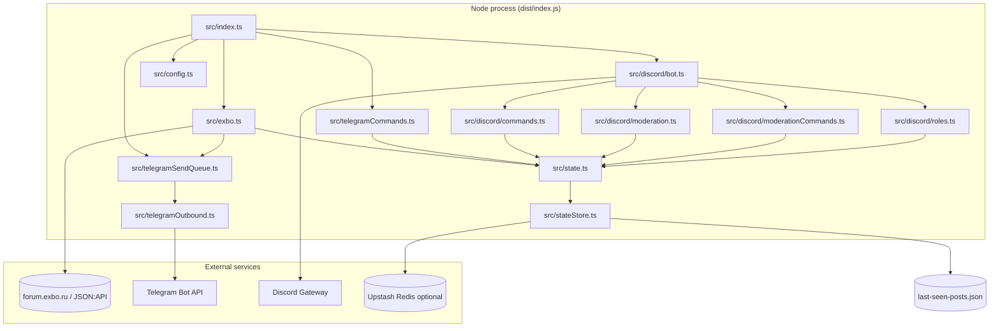
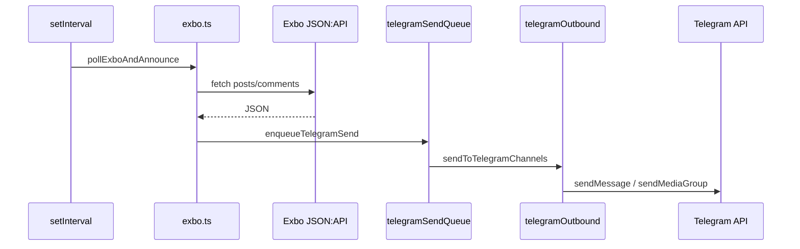
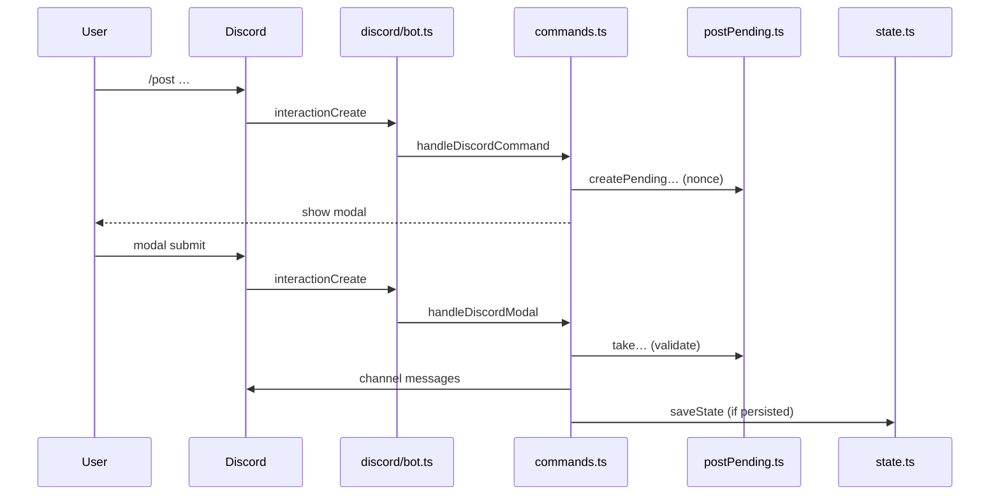
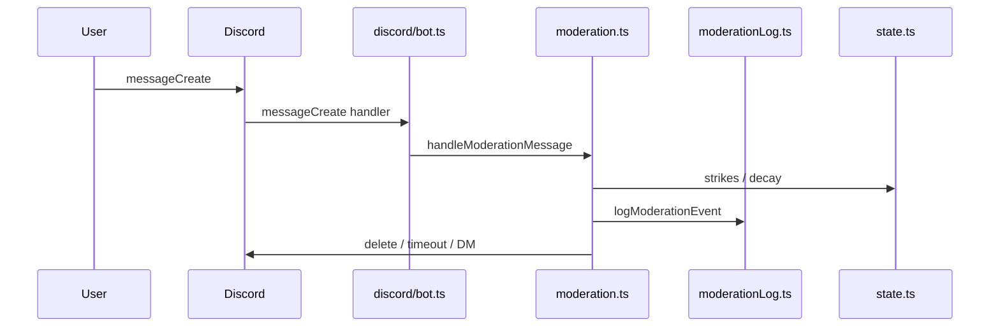

# Codebase Map

> Auto-generated by Cartographer. Last mapped: 2026-05-14T16:20:28Z

## System Overview

Single Node process that **polls Exbo (Flarum JSON:API)** for new forum activity, **announces to Telegram** (HTML + optional images), and runs a **Discord bot** for slash tools (posts, role panels, link panel) plus **automod** and **staff moderation** commands. Shared **JSON state** persists last-seen post IDs, Exbo author list, Discord moderation counters, and role-panel metadata—either on disk or **Upstash Redis**.



## Directory Structure

```
tg-bot-sc-announcer/
├── package.json              # build/start scripts; Telegraf, discord.js, Upstash
├── tsconfig.json             # strict TS → CommonJS dist/
├── README.md                 # env and behavior reference (often richer than .env.example)
├── .env.example              # minimal env template
├── last-seen-posts.json      # default local state file (gitignored in practice)
├── src/
│   ├── index.ts              # entry: Telegraf + Discord + Exbo interval + optional HTTP
│   ├── config.ts             # env parsing, policies, chat IDs, helpers
│   ├── state.ts              # in-memory state + load/save + moderation helpers
│   ├── stateStore.ts         # file vs Upstash persistence
│   ├── exbo.ts               # Exbo poll loop → Telegram enqueue
│   ├── telegramCommands.ts   # Telegraf /addauthor etc.
│   ├── telegramOutbound.ts   # send HTML + media to all Telegram chats
│   ├── telegramSendQueue.ts  # serializes outbound Telegram sends
│   └── discord/
│       ├── bot.ts            # Discord client, intents, slash registration, routing
│       ├── commands.ts       # /post /edit /rolepanel /linkpanel + modals
│       ├── moderation.ts     # message automod + timeouts + notices
│       ├── moderationCommands.ts  # /mute /strike /ban … slash handlers
│       ├── moderationLog.ts  # mod log channel embeds + staff summaries
│       ├── postPending.ts    # nonce store for slash→modal flows (TTL)
│       ├── roles.ts          # role panel button interactions
│       ├── rolePanelHydrate.ts  # rebuild panel state from live messages
│       ├── buttonEmoji.ts    # <:custom:123> parsing for components
│       ├── types.ts          # shared Discord TS types
│       └── userStrings.ts    # RU UI strings for Discord surfaces
└── docs/
    └── CODEBASE_MAP.md       # this file
```

## Module Guide

### Core runtime (`src/index.ts`, `src/config.ts`)

**Purpose**: Wire process lifecycle and central configuration.

**Entry point**: `src/index.ts`

**Key files**:

| File | Purpose | Tokens (est.) |
|------|---------|----------------|
| `src/index.ts` | Validates critical env, starts Telegraf + Discord + Exbo poll + optional `PORT` health | 596 |
| `src/config.ts` | Parses env (Telegram, Exbo, Discord policies, Redis); `chatIds`, `sleep`, policies | 2216 |

**Exports**: `config.ts` exports many `const` settings and types (`StateBackend`, policy maps, etc.).

**Dependencies**: `discord/types` from config for policy typing.

**Dependents**: Nearly all modules import `config.ts`.

**Gotchas**: Process exits if `TELEGRAM_BOT_TOKEN`, `DISCORD_BOT_TOKEN`, or `DISCORD_GUILD_ID` is missing. README lists more env vars than `.env.example`.

---

### State (`src/state.ts`, `src/stateStore.ts`)

**Purpose**: Authoritative in-memory state and persistence.

**Entry point**: `loadState` / `saveState` from `state.ts`.

**Key files**:

| File | Purpose | Tokens (est.) |
|------|---------|----------------|
| `src/state.ts` | Exbo authors, last-seen IDs, moderation maps, role panels; migration from legacy keys | 3397 |
| `src/stateStore.ts` | `createStateStore`: local JSON file or Upstash string blob | 479 |

**Dependents**: `exbo.ts`, `telegramCommands.ts`, Discord command/moderation/role paths.

**Gotchas**: `loadState` tolerates missing file; corrupt JSON may partially apply. Upstash requires REST URL + token or constructor throws.

---

### Telegram / Exbo (`src/exbo.ts`, `src/telegram*.ts`)

**Purpose**: Poll forum API and deliver announcements to Telegram safely.

**Key files**:

| File | Purpose | Tokens (est.) |
|------|---------|----------------|
| `src/exbo.ts` | `pollExboAndAnnounce`: fetch JSON:API, build HTML payloads, update last-seen | 8034 |
| `src/telegramOutbound.ts` | `sendToTelegramChannels`, `AnnouncePayload` | 609 |
| `src/telegramSendQueue.ts` | `enqueueTelegramSend`, `flushTelegramSendQueue` | 153 |
| `src/telegramCommands.ts` | `registerAdminCommands` (author CRUD); empty `ADMIN_USER_IDS` ⇒ everyone is admin | 616 |

**Gotchas**: Old posts may advance `lastSeenByAuthor` without send when `SKIP_SEND_POST_OLDER_THAN_MS` applies. Use queue for all sends—bypassing it risks overlap. Forum profile URL uses display name in path.

---

### Discord (`src/discord/*`)

**Purpose**: Guild slash UX, automod, staff tools, role panels.

**Entry point**: `startDiscordBot` in `discord/bot.ts`.

**Key files** (selected):

| File | Purpose | Tokens (est.) |
|------|---------|----------------|
| `discord/bot.ts` | Intents, `guild.commands.set`, interaction + message routing | 647 |
| `discord/commands.ts` | `/post`, `/edit`, `/rolepanel`, `/linkpanel`, modals | 11231 |
| `discord/moderation.ts` | `handleModerationMessage`, timeouts, invite/spam logic | 7172 |
| `discord/moderationCommands.ts` | `/mute`, `/strike`, `/ban`, … | 7981 |
| `discord/moderationLog.ts` | Mod log channel embeds | 1131 |
| `discord/postPending.ts` | Pending slash→modal nonces (15m TTL) | 1259 |
| `discord/roles.ts` | Role panel buttons | 1366 |
| `discord/rolePanelHydrate.ts` | Rebuild panel from message components | 797 |
| `discord/userStrings.ts` | Centralized RU strings for Discord | 4677 |
| `discord/types.ts` | Policy + role panel types | 259 |
| `discord/buttonEmoji.ts` | Custom emoji in button labels | 288 |

**Gotchas**: Empty `DISCORD_ADMIN_ROLE_IDS` makes slash “elevated” checks permissive at app level (Discord still enforces token permissions). If automod message delete fails, moderation may short-circuit. Restart clears `postPending` entries.

---

## Data Flow

### Exbo → Telegram announcement



### Discord slash → modal → post



### Automod on message



## Conventions

- **TypeScript**: `strict`, ES2022 target, CommonJS `dist/` output.
- **Strings**: Discord user-facing copy concentrated in `discord/userStrings.ts`.
- **State**: Mutations go through `state.ts` helpers; persistence via `saveState` after meaningful changes.
- **Telegram HTML**: `parse_mode: "HTML"` in outbound sender; Exbo builds HTML strings.

## Gotchas

- **Admin bypass**: Empty `ADMIN_USER_IDS` (Telegram) or empty `DISCORD_ADMIN_ROLE_IDS` widens who can pass in-app gates—still subject to platform permissions.
- **State backend**: `STATE_BACKEND=upstash` needs REST URL + token; file mode uses `LAST_SEEN_STATE_FILE` (default `last-seen-posts.json`).
- **Discord intents**: `GuildMembers` and `MessageContent` required for moderation and content inspection—must stay enabled in the Developer Portal.
- **Docs vs example**: Prefer `README.md` for full env semantics when `.env.example` is incomplete.

## Navigation Guide

| Task | Where to start |
|------|----------------|
| **Change Exbo poll / HTML formatting** | `src/exbo.ts`, tuning in `src/config.ts` |
| **Change Telegram delivery / throttling** | `src/telegramOutbound.ts`, `src/telegramSendQueue.ts`, `src/config.ts` |
| **Telegram author admin commands** | `src/telegramCommands.ts`, defaults in `src/state.ts` |
| **Add or change a slash command** | `src/discord/commands.ts` (+ `discord/bot.ts` if new routing), strings in `discord/userStrings.ts` |
| **Automod rules / severities** | `src/config.ts` (policies), `src/discord/moderation.ts`, types `src/discord/types.ts` |
| **Staff `/mute` `/ban` / mod log** | `src/discord/moderationCommands.ts`, `src/discord/moderationLog.ts` |
| **Role panel behavior** | `src/discord/commands.ts`, `src/discord/roles.ts`, `src/discord/rolePanelHydrate.ts`, `src/state.ts` |
| **Copy / locale for Discord** | `src/discord/userStrings.ts` |
| **Persistence / Redis** | `src/stateStore.ts`, `src/state.ts`, env in `src/config.ts` |

---

*Subagent-sourced per-file notes (absolute paths) were merged into this map; see exploration report in the Cartographer run for full per-file bullet lists.*
